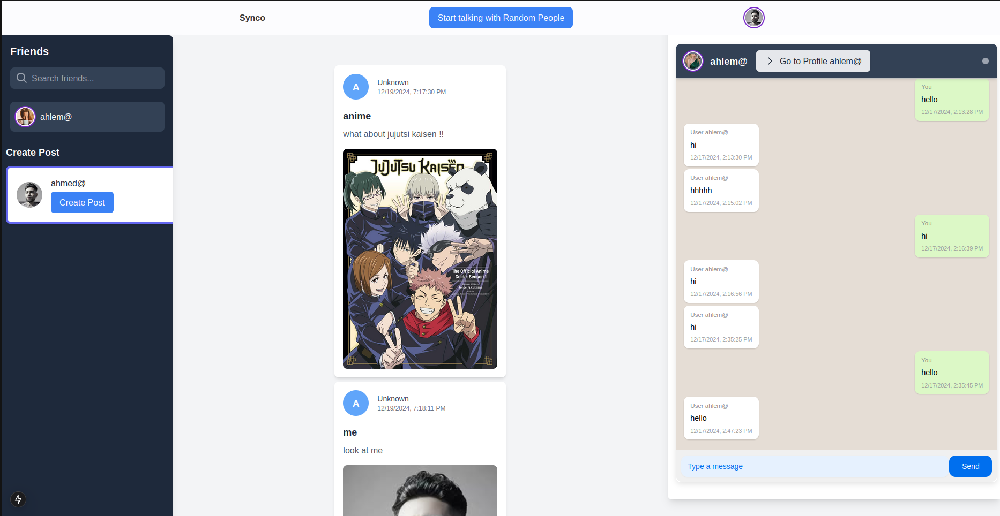

# 🎉 Welcome to Chativerse! 🌐💬

**Chativerse** is the ultimate SaaS platform for spontaneous, random chats where connection meets fun! Every conversation is a new adventure waiting to happen. 🌟

## 🚀 What Makes Chativerse Awesome?

### 🌈 Dynamic Chat Rooms
- **Start Talking with Random People**: Connect instantly with strangers and start spontaneous conversations with one click. **Break the ice, share ideas, and enjoy the excitement!** 🌏✨
- If the conversation goes well, you can **make new friendships** and stay connected forever.

### 🤝 Friendships & Real-Time Chat
- **Friendships**: Users can send friend requests and build long-term connections.
- **Chat Anytime**: Friends can continue chatting at any time, with the chat history saved seamlessly for future conversations.

### 📩 Persistent Chat Messages
- Messages are stored so that you and your friends can always revisit and continue past conversations. No more losing track of meaningful chats! 💬🗒

### 💽 Create Posts
- **Anonymous and Non-Anonymous Posts**: Express yourself freely! Users can:
   - Create posts as themselves (non-anonymous). 🗒
   - Create posts anonymously to share thoughts privately without revealing their identity. 🤫

### 👨‍🤝👩 Profile Management
- Users can **view their profile** to check personal details, manage posts, and chat history.
- **View Friends' Profiles**: See your friends' profiles and get to know them better.

### 🕺 Fun Emoji Reactions
Add some flair to your conversations! Use fun emoji reactions to express your emotions and keep the chat lively. 😄❤️🔥

### 📱 Cross-Platform Compatibility
Chativerse is accessible on any device. Whether you’re on your laptop, tablet, or smartphone, the chat experience is seamless. **Connect wherever you go!** 📲💻

### ⚡ Real-Time Notifications
Never miss a moment! With real-time notifications, you’ll always be updated on your chats and messages. Stay engaged and connected with ease! 🔔✨

## 🖼 Screenshot of Chativerse

Here’s a sneak peek of Chativerse in action! 👇

> *Screenshot showing the ability to chat with friends, start random conversations, and manage profiles.*

## 🌟 How to Get Started

1. **Sign Up**: Create your Chativerse account in seconds. 🎉
2. **Start Talking**: Click on **"Start talking with Random People"** to begin a chat. 🛋️
3. **Make Friends**: If the conversation goes well, send a friend request and stay connected! 🤝
4. **Create Posts**: Share your thoughts as yourself or anonymously. 🗒✨
5. **Explore Profiles**: View your own profile or your friends' profiles to connect even deeper.

## 🤝 Join the Community
Chativerse is more than just a platform; it's a community! Connect with like-minded individuals, share experiences, and create memories. Join us today and be part of something special! 🌍💖

## 📄 License
This project is licensed under the MIT License - see the [LICENSE](LICENSE) file for details.

---

**Feel the excitement? Ready to chat? Let's connect!** 🎊✨

